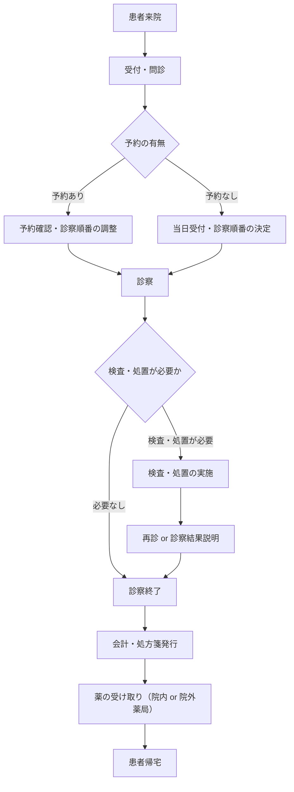

# 外来診療に関わるシステム

## 外来診療とは？

```
患者が病院や診療所に来院し、診察や治療を受けた後に自宅へ帰る診療のこと
```

## 外来診療のワークフロー


```mermaid
graph TD;
    A[患者来院] --> B[受付・問診]
    B --> C{予約の有無}
    C -- 予約あり --> D[予約確認・診察順番の調整]
    C -- 予約なし --> E[当日受付・診察順番の決定]
    D --> F[診察]
    E --> F[診察]
    F --> G{検査・処置が必要か}
    G -- 必要なし --> J[診察終了]
    G -- 検査・処置が必要 --> H[検査・処置の実施]
    H --> I[再診 or 診察結果説明]
    I --> J[診察終了]
    J --> K[会計・処方箋発行]
    K --> L[薬の受け取り（院内 or 院外薬局）]
    L --> M[患者帰宅]
```

## 外来診療のシステムと機能

### 受付・予約

### 診察

### 会計

### 会計後

